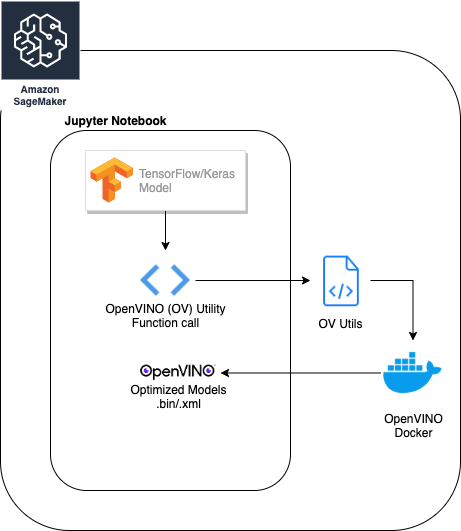
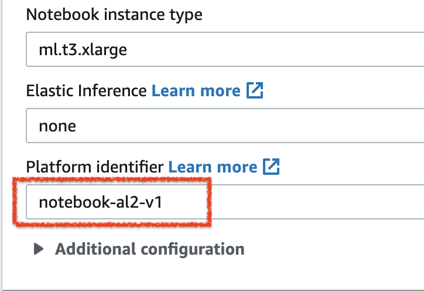

# OpenVINO™ Model Optimization in AWS Sagemaker

This demonstrates a OpenVINO utility to convert Keras or TFHub models or TF object detection models in AWS Sagemaker notebook instance.

## Prerequisites

- AWS Sagemaker notebook instance. 
	- Recommended instance type: `ml.t3.xlarge`
	- Choose `notebook-al2-v1` or `notebook-al2-v2` as Platform identifier. `al2` refers to Amazon Linux 2.

## Instructions

1. Launch AWS Sagemaker Jupyer Notebook instance. See [Prerequisites](#prerequisites).
2. Upload the [ov_utils.py](ov_utils.py) and [requirements.txt](requirements.txt)
3. Upload one of the jupyter notebook from this repo as per your requirement. See [Examples](#examples).
4. Follow the instruction provided in Jupyter Notebook.

## Examples

- For Keras models, run [create_ir_for_keras.ipynb](create_ir_for_keras.ipynb). See [Keras-SupportedModelList.md](supported_model_list/Keras-SupportedModelList.md)
- For TFHub models, run [create_ir_for_tfhub.ipynb](create_ir_for_tfhub.ipynb). See [TFHub-SupportedModelList.md](supported_model_list/TFHub-SupportedModelList.md)
- For Object detection models, run [create_ir_for_obj_det.ipynb](create_ir_for_obj_det.ipynb). See [ObjDet-SupportedModelList.md](supported_model_list/ObjDet-SupportedModelList.md)
